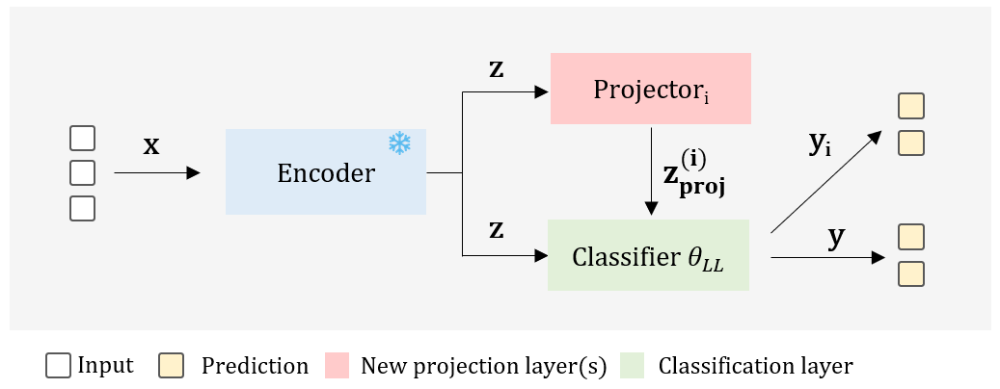

# Latent Uncertainty Representation
Latent Uncertainty Representations for Video-based Driver Action and Intention Recognition

### Abstract
Deep neural networks (DNNs) are widely used in safety-critical applications such as driver action and intention recognition, but can suffer from overconfident predictions or unreliable uncertainty estimates. Last layer probabilistic deep learning (LL-PDL) approaches introduce stochasticity in the final classification layer to estimate uncertainty, but their effectiveness for detecting out-of-distribution (OOD) instances varies. In this paper, we propose extending pre-trained or fine-tuned DNNs with additional transformation layers to produce multiple latent representations. We compare the  latent uncertainty representation (LUR) and a repulsive LUR (RLUR) approaches to eight PDL approaches in terms of classification performance, calibration, and uncertainty-based OOD detection across four video-based driver action and intention recognition datasets. We introduce a new offline driver intention recognition benchmark for the NuScenes dataset and release annotations of 28,000 frame-level action labels and 1,194 video-level intention labels. Our results show that LUR and RLUR yield comparable in-distribution classification performance compared to the other LL-PDL approaches. For the uncertainty-based OOD detection, LUR and RLUR consistently rank among the top-performing approaches.  



### TLDR:
The introduction of trainable transformation layers and extending the prediction loss function improves the OOD detection performance.

## Implementation
Integrating LUR into standard models is simple, and only requires adding the projection layers, updating the forward pass and the loss function to guide the training. 

**Original architecture:**
```python 
class MLP(nn.Module):
    def __init__(self, in_features, hidden_dim, out_features):
        super().__init__()
        self.input = nn.Linear(in_features, hidden_dim)
        self.hidden = nn.Linear(hidden_dim, hidden_dim)
        self.fc = nn.Linear(hidden_dim, out_features)
        self.activation = nn.ReLU()

    def forward(self, x, y=None):
        x = self.activation(self.input(x))
        x = self.activation(self.hidden(x))
        return self.fc(x)
```
**Modified architecture:**
```python 
class LUR_MLP(nn.Module):
    def __init__(self,
                 in_features,
                 hidden_dim,
                 out_features,
                 num_projections):
        super().__init__()
        self.input = nn.Linear(in_features, hidden_dim)
        self.hidden = nn.Linear(hidden_dim, hidden_dim)
        self.projections = nn.ModuleList([nn.Linear(hidden_dim, hidden_dim) for _ in range(num_projections)])
        self.fc = nn.Linear(hidden_dim, out_features)
        self.activation = nn.ReLU()

    def forward(self, x):
        x = self.activation(self.input(x))
        z = self.activation(self.hidden(x))
        y = self.output(z)
        output = [y]

        for i, proj in enumerate(self.projections):
            z_p = self.activation(proj(z))
            output.append(self.fc(z_p))
        return output
```

### Loss function example

```python
criterion = nn.CrossEntropyLoss()
output = model(x) # returns the prediction set
loss = torch.stack([criterion(y, target) for y in output]).sum()
```
